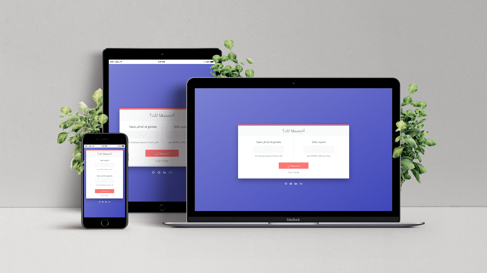

<h1 style="text-align:right;">أحسبها لك؟</h1>

تطبيق بسيط بيعمل لك حسبة تقريبية للأقساط والفوايد اللي هتدفعها لو استخدمت بطاقتك الأتمانية ، على اعتبار /

<ul>
  <li>أن القسط الشهري مايكونش أقل من ( 5% ) من قيمة المعاملة.</li>
  <li>وأن معاك ليوم ( 27 ) من الشهر اللي بعد المعاملة فترة سماح تقدر تسدد خلالهم بدون فوايد.</li>
  <li>وانك هتدفع أول قسط قبل يوم ( 27 ) من نفس الشهر، علشان يبقى أول قسطين في فترة السماح.</li>
  <li>وأن بعد فترة السماح هيتضاف ( 2.2% ) من الباقي عليك كفوايد بنكية كل شهر.</li>
</ul>

---

### تنبيه هام:
الحسبة دي أساسها اللي فهمته من البنك بخصوص ( الفيزا الأتمانية بضمان المرتب من بنك مصر )، بس لا أنا ولا أي بنك مسئول بأي شكل من الأشكال عن أي ضرر يحصل لك بسبب اختلاف ما بين نتيجة الحسبة دي ومعاملاتك الواقعية مع البنك.

